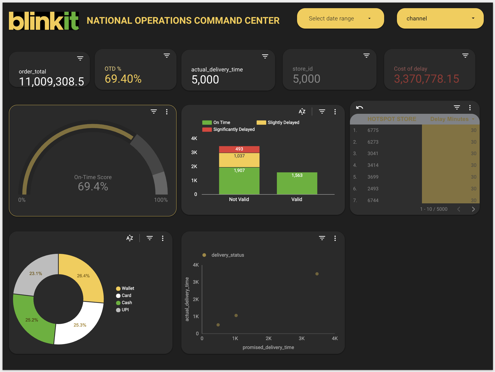
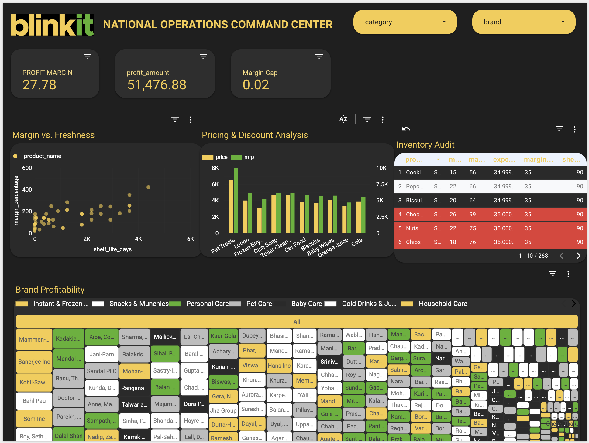
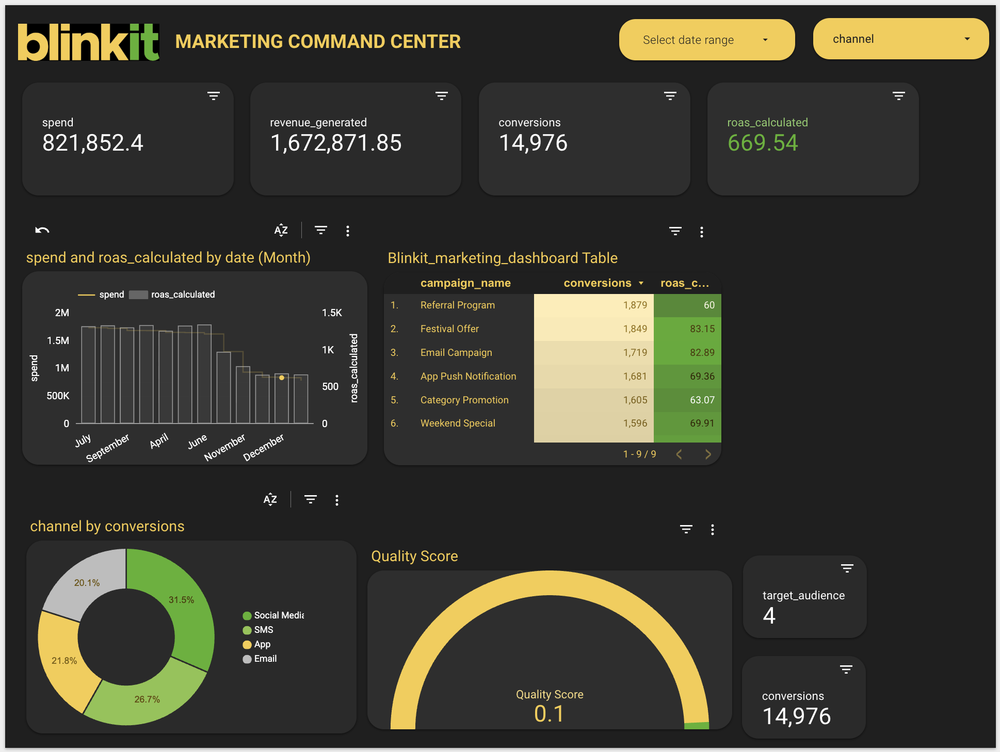

# 🛒 Blinkit National Operations, Marketing & Product Intelligence Hub

## 🔗 Live Interactive Dashboard
[👉 View Full Interactive Report](https://lookerstudio.google.com/reporting/464dd2e8-8213-44f5-97d0-15002fb0aef2)

---

## 📊 Executive Summary
This project is an advanced **360° Command Center** designed for Blinkit’s National Management. It transitions from raw data to actionable "Operational Intelligence" using a custom high-end dark theme. The dashboard enables real-time monitoring of marketing ROI, delivery logistics, and inventory shelf-life risk.

---

## 🚀 Three-Pillar Business Analysis

### 1. Operations & Logistics Command Center
*Focus: Protecting Revenue through Speed & Accuracy*

* **KPI - On-Time Delivery (OTD)**: Currently at **69.4%**, identifying a need for immediate logistics optimization.
* **Revenue at Risk**: Real-time tracking of **₹3.37M** currently tied up in significantly delayed orders.
* **Algorithm Accuracy**: A stacked analysis of "Valid vs. Not Valid" logic to pinpoint system failures causing late deliveries.

### 2. Product Intelligence & Inventory Health
*Focus: Maximizing Margins & Reducing Waste*

* **Margin vs. Freshness Matrix**: A scatter plot analysis identifying high-margin products with low shelf life (High-Risk/High-Reward).
* **Expiration Crisis Alerts**: Automated conditional formatting flags any product with **< 3 Days** shelf life for immediate markdown or liquidation.
* **Brand Profitability**: Treemap visualization identifying the top 5 brands driving 80% of national profit.

### 3. Marketing Performance Intelligence
*Focus: ROAS Optimization & Customer Acquisition*

* **Revenue Generation**: ₹32.19M generated with an average **ROAS of 2.74x**.
* **Channel Performance**: Identification of **App Push Notifications** as the most efficient channel for conversions compared to SMS/Email.
* **Conversion Funnel**: Analysis of 29.5M impressions to 298K conversions.

---

## 🛠️ Technical Stack & Implementation
* **Platform**: Looker Studio (Advanced Data Modeling)
* **Data Source**: Cleaned Google Sheets/CSV Datasets
* **Custom Logic (SQL/Regex)**:
    * **Revenue at Risk**: `SUM(CASE WHEN UPPER(TRIM(delivery_status)) != 'ON TIME' THEN order_total ELSE 0 END)`
    * **Stock Health Scoring**: Logic-based flags for inventory "Hotspots."

---

## 📈 Strategic Business Insights
1.  **Operational Bottleneck**: Analysis shows that "Not Valid" algorithm triggers are the #1 contributor to delivery delays, leading to the ₹3M revenue risk.
2.  **Inventory Strategy**: Dairy and Fresh produce show the highest margin but the highest expiration risk; a "First-Expire-First-Out" (FEFO) strategy is recommended.
3.  **Marketing Efficiency**: App-based marketing yields a 12% higher CTR than SMS, suggesting a shift in budget allocation toward mobile engagement.

---

## 📁 Repository Structure
- `marketing_page.png` / `ops_page.png` / `products_page.png`: High-resolution dashboard previews.
- `calculations.sql`: Comprehensive list of calculated fields and business logic.
- `Blinkit_National_Report.pdf`: Static version of the dashboard for offline viewing.

---