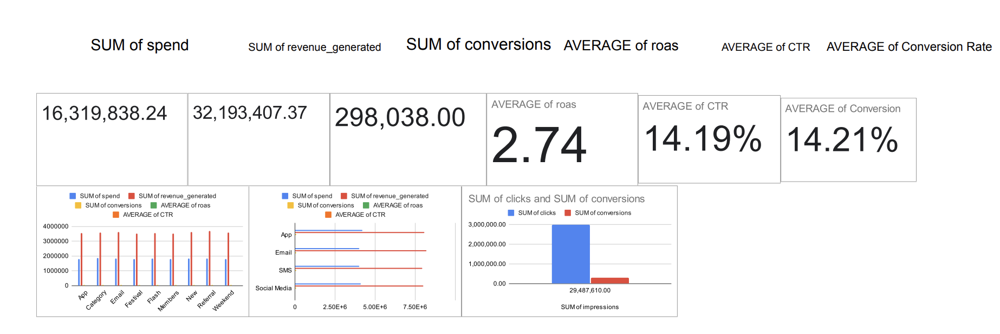

# Blinkit Marketing Dashboard Analysis

## Project Overview
This project focuses on analyzing Blinkit's marketing campaigns to evaluate the performance across different campaigns, channels, and target audiences. The analysis aims to provide insights into campaign effectiveness, Return on Ad Spend (ROAS), conversion performance, and overall marketing efficiency.  

The ultimate goal is to create a clean and interactive dashboard that helps stakeholders make informed marketing decisions.

---

## Image
  
*Dashboard showing campaign performance, channel insights, and key marketing KPIs.*

---

## File Details
- `blinkit_marketing_data.csv` – Raw marketing campaign data including campaign metrics and performance indicators.  
- `blinkit_marketing_dashboard.xlsx` – Processed pivot tables and dashboard used for analysis.  
- `README.md` – Project documentation and key insights.  

---

## Data Dictionary

| Column Name | Description |
|-------------|-------------|
| `campaign_id` | Unique identifier for each marketing campaign |
| `campaign_name` | Name of the marketing campaign |
| `date` | Campaign execution date |
| `target_audience` | Specific audience segment targeted by the campaign |
| `channel` | Marketing channel used (App, Email, SMS, Social Media) |
| `impressions` | Number of times the campaign was displayed |
| `clicks` | Number of clicks received |
| `conversions` | Number of successful conversions resulting from the campaign |
| `spend` | Total campaign expenditure |
| `revenue_generated` | Revenue generated from the campaign |
| `roas` | Return on Ad Spend = Revenue / Spend |
| `new_roas` | Adjusted or updated ROAS metric |
| `CTR` | Click-Through Rate = Clicks / Impressions |
| `Conversion Rate` | Conversion Rate = Conversions / Clicks |

---

## Key Insights and Statistics

### Overall Performance
| Metric | Value |
|--------|-------|
| Total Spend | ₹16,319,838.24 |
| Total Revenue | ₹32,193,407.37 |
| Total Conversions | 298,038 |
| Average ROAS | 2.74 |
| Average CTR | 14.19% |
| Average Conversion Rate | 14.21% |

### Top Campaign Performance
| Campaign Name | Spend | Revenue | Conversions | ROAS | CTR |
|---------------|-------|---------|-------------|------|-----|
| App Push Notification | ₹1,788,989.20 | ₹3,554,370.00 | 32,783 | 2.76 | 14.85% |
| Email Campaign | ₹1,810,729.67 | ₹3,601,785.22 | 32,436 | 2.78 | 14.30% |
| New User Discount | ₹1,833,454.81 | ₹3,603,860.17 | 33,964 | 2.75 | 14.14% |
| Referral Program | ₹1,818,025.51 | ₹3,691,382.60 | 33,490 | 2.74 | 14.48% |
| Flash Sale | ₹1,831,687.82 | ₹3,556,087.02 | 33,211 | 2.71 | 14.19% |

### Channel Performance
| Channel | Spend | Revenue | Conversions | ROAS | CTR |
|---------|-------|---------|-------------|------|-----|
| App | ₹4,213,378.75 | ₹8,075,010.49 | 75,192 | 2.75 | 13.71% |
| Email | ₹3,997,488.04 | ₹8,189,331.58 | 74,671 | 2.75 | 14.85% |
| SMS | ₹3,998,607.54 | ₹7,938,649.32 | 73,235 | 2.71 | 14.27% |
| Social Media | ₹4,110,363.91 | ₹7,990,415.98 | 74,940 | 2.75 | 13.94% |

### Funnel Summary
| Metric | Value |
|--------|-------|
| Total Impressions | 29,487,610 |
| Total Clicks | 2,974,145 |
| Total Conversions | 298,038 |

---

## Data Cleaning Notes
- Removed duplicate campaign entries.  
- Standardized column names (`campaign_id`, `campaign_name`, `target_audience`, etc.) for consistency.  
- Calculated additional metrics:  
  - `CTR = Clicks / Impressions`  
  - `Conversion Rate = Conversions / Clicks`  
  - `ROAS = Revenue / Spend`  
- Checked for missing values in `spend`, `revenue_generated`, and `conversions`. Missing data was either imputed with 0 or removed depending on the context.  
- Ensured all currency values were in INR and all percentages were formatted to two decimal points.  

---

## Dashboard Image
  
*Dashboard showing overall KPIs, top-performing campaigns, channel performance, and funnel metrics.*

---

## Insights
1. **Top Performing Campaigns**: Referral Program, New User Discount, and Email Campaign generated the highest revenue with ROAS around 2.74–2.78.  
2. **Channel Effectiveness**: App and Email channels provide the highest revenue contribution; SMS has slightly lower ROAS but still significant conversions.  
3. **CTR and Conversion Rates**: CTR ranges between 13–15%, Conversion Rate consistently around 14%, indicating good engagement.  
4. **Spend vs Revenue**: All campaigns maintain ROAS above 2.7x, showing efficient marketing spend.  
5. **Campaign Funnel**: Out of ~29.5M impressions, ~3M clicks and ~298K conversions indicate ~10% CTR and ~10% conversion rate, highlighting room for optimization in click-to-conversion.

---

## Conclusion
The Blinkit marketing analysis provides a clear view of campaign performance, highlighting top campaigns, efficient channels, and high-performing audience segments. Overall, the campaigns are yielding a **ROAS above 2.7x** and stable conversion rates, indicating effective budget utilization.  

This dashboard allows stakeholders to **quickly identify high-performing campaigns, monitor channel efficiency, and optimize future marketing strategies**.  

---

